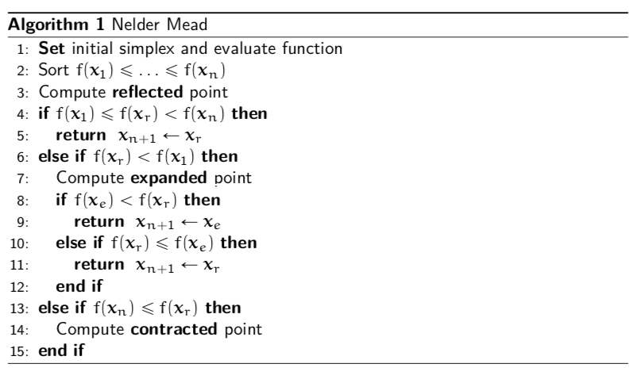

<style>
    slides > slide {
    overflow-x: auto !important;
    overflow-y: auto !important;
}
</style>


```{r setup, include=FALSE}
knitr::opts_chunk$set(tidy.opts = list(width.cutoff=60),
                      tidy = TRUE, 
                      echo = TRUE)
options(width = 60)
```

# Motivation

## Discontinuous Functions

- The Newton Method requires first and second derivatives.
- If derivatives are not available the they can be approximated by
Quasi-Newton methods.
- What if the derivatives do not exist?
- This may occur if there are discontinuities in the function.

## Business Example

- Suppose the aim is to optimize income of the business by selecting the number of workers.
- In the beginning adding more workers leads to more income for the business.
- If too many workers are employed, they may be less efficient and the income of the company goes down.

## Business Example
<center>

</center>

## Business Example

- Now suppose that there is a tax that the company must pay. 
- Companies with less than 50 workers do not pay the tax.
- Companies with more than 50 workers do pay the tax.
- How does this change the problem?

## Business Example
<center>

</center>

## The Nelder Mead Algorithm
- The Nelder Mead algorithm is robust even when the functions are discontinuous.
- The idea is based on evaluating the function at the vertices of an n-dimensional simplex where n is the number of input variables into the function.
- For two dimensional problems the n-dimensional simplex is simply a triangle, and each corner is one vertex
- In general there are n + 1 vertices.

## A 2-dimensional simplex
<center>

</center>

## Step 1: Evaluate Function

- For each vertex ${\mathbf x_j}$ evaluate the function $f({\mathbf x_j})$
- Order the vertices so that $$f({\mathbf x_1})\leq f({\mathbf x_2})\leq\ldots\leq f({\mathbf x_{n+1}}).$$
- Suppose that the aim is to  minimize the function, then $f({\mathbf x_{n+1}})$ is the worst point.
- The aim is to replace $f({\mathbf x_{n+1}})$ with a  better point.
   
## A 2-dimensional simplex
<center>                                                              

</center>      

## Step 2: Find Centroid

- After eliminating the worst point ${\mathbf x_{n+1}}$, compute the  centroid of the remaining $n$ points $${\mathbf x_0}=\frac{1}{n}\sum_{j=1}^{n}  {\mathbf x_j}.$$
- For the 2-dimensional example the centroid will be in the middle of a line.

## Find Centroid 
<center>                                                              

</center>   


## Step 3: Find reflected point

- Reflect the worst point around the centroid to get the  reflected point.
- The formula is: $${\mathbf x_r}={\mathbf x_0}+\alpha({\mathbf x_0}-{\mathbf x_{n+1}}).$$
- A common choice is $\alpha=1$.
- In this case the reflected point is the same distance from the centroid as the worst point.
      
## Find Reflected Point
<center>                                                              

</center>   

## Find Reflected Point
<center>                                                              

</center>   

## Three cases

1. $f({\mathbf x_1})\leq f({\mathbf x_r})<f({\mathbf x_n})$
    - ${\mathbf x_r}$ is neither best nor worst point
2. $f({\mathbf x_r})<f({\mathbf x_1})$
    - ${\mathbf x_r}$ is the best point
3. $f({\mathbf x_r})\geq f({\mathbf x_n})$
    - ${\mathbf x_r}$ is the worst point

## Case 1

 In Case 1 a new simplex is formed with ${\mathbf x_{n+1}}$ replaced by the reflected point ${\mathbf x_{r}}$.  Then go back to step 1.
 
<center>                                                              

</center>  


## Case 1

<center>                                                              

</center>

## Case 2

In Case 2, ${\mathbf x_r}<{\mathbf x_1}$. A good direction has been found so we expand along that direction $$ {\mathbf x_e}={\mathbf x_0}+\gamma({\mathbf x_r}-{\mathbf x_0}).$$
                                                                     
A common choice is $\gamma=2$


## Case 2

<center>                                                              

</center>

## Case 2

<center>                                                              

</center>

## Choosing the Expansion Point
- Evaluate $f({\mathbf x_e})$.
- If $f({\mathbf x_e}) < f({\mathbf x_r})$:
    - The expansion point is better than the reflection point. Form a new simplex with the expansion point
- If $f({\mathbf x_r})\leq f({\mathbf x_e})$:
    - The expansion point is not better than the reflection point. Form a new simplex with the reflection point.
                                           
## Keep Expansion Point
<center>                                                              

</center>

## Keep Relection Point
<center>                                                              

</center>

## Case 3

Case 3 implies that there may be a valley between ${\mathbf x_{n+1}}$ and ${\mathbf x_{r}}$ so find the  contracted point.  A new simplex is formed with the contraction point if it is better than ${\mathbf x_{n+1}}$
        $${\mathbf x_c}={\mathbf x_0}+\rho({\mathbf x_{n+1}}-{\mathbf x_0})$$

A common choice is $\rho=0.5$

## Case 3
<center>                                                              

</center>

## Valley
                                                            
<center>  

</center>


## Find Contraction point
<center>                                                              

</center>

## New Simplex

<center>                                                              

</center>

## Shrink

If $f({\mathbf x_{n+1}})\leq f({\mathbf x_{c}})$ then contracting away from the worst point does not lead to a better point.  In this case the function is too irregular a smaller simplex should be used.  Shrink the simplex $${\mathbf x_i}={\mathbf x_1}+\sigma({\mathbf x_i}-{\mathbf x_1})$$

A popular choice is $\sigma=0.5$.
  
## Egg Carton
<center>  

</center>


## Contraction Point is worst
<center>                                                              

</center>

## New Simplex
<center>                                                              

</center>

## Summary

- Order points
- Find centroid
- Find reflected point
- Three cases:
    1. Case 1 ($f({\mathbf x_1})\leq f({\mathbf x_r})<f({\mathbf x_n})$): Keep ${\mathbf x_r}$
    2. Case 2 ($f({\mathbf x_r}) < f({\mathbf x_1})$): Find $\mathbf x_e$.
        - If $f({\mathbf x_e})<f({\mathbf x_r})$ then keep $\mathbf x_e$
        - Otherwise keep $\mathbf x_r$
    3. Case 3 ($f({\mathbf x_r})\geq f({\mathbf x_n})$): Find $\mathbf x_c$
        - If $f({\mathbf x_c})<f({\mathbf x_{n+1}})$ then keep $\mathbf x_c$
        - Otherwise shrink

## 

<center>                                                              

</center>

# Coding Nelder Mead

## Your task

- Find the minimum of the function $f({\mathbf x})=x_1^2+x_2^2$
- Use a triangle with vertices $(1,1)$, $(1,2)$, $(2,2)$ as the starting simplex
- Don't worry about using a loop just yet.  Try to get code that just does the first iteration.
- Don't worry about the stopping rule yet either

## Use pseudo-code

<center>                                                              

</center>

## Stopping Rule for Nelder Mead

- As Nelder Mead gets close to (or reaches) the minimum, the simplex gets smaller and smaller.
- One way to know that Nelder Mead has converged is by looking at the volume of the simplex.
- To work out the volume requires some understanding between the relationship between matrix algebra and geometry.
   
## Stopping Rule for Nelder Mead                                     
- Choose the vertex ${\mathbf x_{n+1}}$ (although choosing any other vertex will also work)
- Build the matrix
                                                                                                  $\tilde{X}=\left({\mathbf x_1}-{\mathbf x_{n+1}},{\mathbf x_2-{\mathbf x_{n+1}}},\ldots, {\mathbf x_{n}-{\mathbf x_{n+1}}}\right)$
                          
- The volume of the simplex is $\frac{1}{2}|det(\tilde{X})|$
       
## Why?

<center>                                                              

</center>

## Traslate
<center>                                                              

</center>

## Determinant=Area of Trapezoid
<center>                                                              

</center>

## Triangle=Half Trapezoid
<center>                                                              

</center>

## Alternative formula

Some of you may have learnt the formula for the area of a triangle as:$$\frac{1}{2}\left|det\left(
                                                                                                      \begin{array}{ccc}
                                                                                                        {\mathbf x_1}& {\mathbf x_2}& {\mathbf x_3}\\
                                                                                                        1 & 1 & 1
                                                                                                      \end{array}
                                                                                                    \right)\right|$$
The two approaches are equivalent.


## Nelder Mead in `optim()`

- Nelder Mead is the default algorithm in the R function `optim()`
- It is generally slower than Newton and Quasi-Newton methods but is more stable for functions that are not smooth.
- Including the argument `control=list(trace, REPORT=1)` will print out details about each step of the algorithm.
- Slight different terminology is used for example 'expansion' is called 'extension'

          
## Summary                                                          
- This is the end of the optimization topic.
- You should now be familiar with
    - Newton's Method
    - Quasi Newton Method
    - Nelder Mead
- Hopefully you also improved your coding skills!

## Summary

Some important lessons:

- If you can evaluate derivatives and Hessians then do so when implementing Newton and Quasi-Newton methods.
- If there are discontinuities in the function then Nelder Mead may work better.
- In any case the best strategy is to optimize using more than one method to check that results are robust.
- Also pay special attention to starting values. A good strategy is to check that results are robust to a few different choices of starting values.


