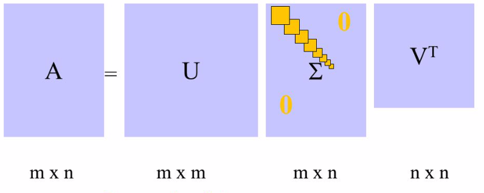
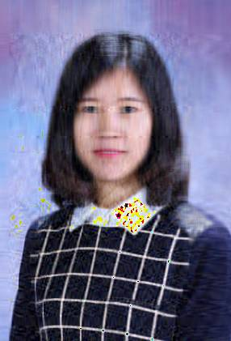

<style>
    slides > slide {
    overflow-x: auto !important;
    overflow-y: auto !important;
}
</style>


```{r setup, include=FALSE}
knitr::opts_chunk$set(tidy.opts = list(width.cutoff=60),
                      tidy = TRUE, 
                      echo = TRUE)
options(width = 60)
```

## Applications of SVD

- In data compression, we start with a matrix A that contains perfect data, and we try to find a (lower-rank) approximation to the data that seeks to capture the principal elements of the data.
     - we sacrifice only the less important parts that don’t degrade data quality too much, in order to gain compression.
- In noise filtering, we start with a matrix A that contains imperfect data, and we try to find a (lower-rank) approximation to the data that seeks to capture the principal elements of the data.
     - we give up only the less important parts that are typically noise.
- So both these tasks are related, and rely on the SVD to find a suitable lower-ranked approximation to a matrix


## Matrix Approximation

- Recall that the SVD of a matrix $A$ in $\mathcal{R}_{m\times n}$ decomposes the matrix into $$A = U\Sigma V^T = \left(\begin{array}{cc}U_1 & U_2\end{array}\right) \left(\begin{array}{cc}
   D & \\
    & 0
   \end{array}\right) \left(\begin{array}{cc}V_1^T & V_2^T\end{array}\right) = U_1^TDV_1^T$$
where $D = \text{diag}\{\alpha_1, \cdots, \alpha_r\} \in \mathcal{R}^{r\times r}$ with $\sigma_r > 0$ for $r = \text{rank}(A)$.
  
- $A$ can also be expressed as a sum of outer products, with each sum being a rank 1 matrix of dimension $m\times n$ 
$$A = \Sigma_{i = 1}^r \sigma_i u_u v_i^T = \alpha_1 u_1 v_1^T + \cdots + \alpha_r u_r v_r^T.$$

- We can truncate this sum when we feel that the singular values are so small that they are not contributing much.

## SVD components


<center>

</center>

## Matrix Approximation Error

- So if we truncate the sum after $k$ singular values, then we are approximating $A$ with
$A_k$

$$A_k = \Sigma_{i = 1}^{k<r} \sigma_i u_u v_i^T = \alpha_1 u_1 v_1^T + \cdots + \alpha_k u_k v_k^T.$$

- The error in the approximation is $\sigma_{k+1}$.

- We have $\text{rank}(A_k) = k < r = \text{rank}(A).$

- By approximating $A$ with $A_k$, we have saved memory:
    - $A$ requires us to store $m\times n$ numbers
    - $A_k$ requires us to store ??? numbers?
    
– Significant savings for large matrices, and/or small $k$.

# Image Compression

## Image Compression

- Suppose we have a grayscale image ($128 \times 128$ pixels).
    - We can use a matrix to represent this image.
- If we have a colour image, it has three matrices, with the same size as the image. Each matrix represents a color value that comprises the RGB color scale. 
- Each pixel is represented by an integer from 0-255.
- Next, we can decompose the matrix by SVD.
- By eliminating small singular values, we can approximate the matrix.
    - Choose the value of $k$ for the low-rank approximation $A_k$.
    - Plotting the singular values might help identify where there is a noticeable drop in significance
    
## Reconstructing approximated image

- Suppose we have chosen the value of $k$ = number of singular values we wish to retain. - We can generate a new image matrix by expanding $A$ using the SVD (first $k$ singular values only).
- If you want to use colour images, do it for R, G, B matrices separately and then reassemble.

## Data compression in R

```{r, eval=TRUE, echo=FALSE}
library(jpeg)
ykang <- readJPEG('./figs/ykang.jpg')
r <- ykang[,,1]
g <- ykang[,,2]
b <- ykang[,,3]
ykang.r.svd <- svd(r)
ykang.g.svd <- svd(g)
ykang.b.svd <- svd(b)
rgb.svds <- list(ykang.r.svd, ykang.g.svd, ykang.b.svd)
for (j in seq.int(4, 200, length.out = 8)) {
  a <- sapply(rgb.svds, function(i) {
    ykang.compress <- i$u[,1:j] %*% diag(i$d[1:j]) %*% t(i$v[,1:j])
  }, simplify = 'array')
  writeJPEG(a, paste('./figs/', 'ykang_svd_rank_', round(j,0), '.jpg', sep=''))
}
```
Here are four images with rank 286, 200, 116 and 32. How many numbers to store for each of them?


<p float="center">
   
   
  
  
</p>

## Plot of singular values

```{r, echo = FALSE, fig.align = 'center'}
plot(ykang.r.svd$d, type = 'l', ylab = 'Singular values')
```

# Lab session

##

- Like in today’s lecture, take a high resolution image of yourself, and produce a sequence of low rank approximations.
- How much can you save?


# Noise reduction

## Noise reduction

- The SVD also has applications in digital signal processing
- The central idea is to let a matrix $A$ represent the noisy signal, compute the SVD, and then discard small singular values of $A$.
- It can be shown that the small singular values mainly represent the noise, and thus the rank $k$ matrix $A_k$ represents a filtered signal with less noise.

## Application to Signal Separation

- Suppose we have $P$ observed signals $m_i(t)$ which are linear combinations of r source signals $s_i(t)$, corrupted by noise signals $n_i(t)$. We have a time series of data from $T$ time periods
- This can be written as: 
$$m_i(t) = \alpha_{i1}s_1(t) + \cdots + a_{ir}s_r(t) + n_i(t),$$ where $t = 1, \cdots, T$ and $i = 1, \cdots, P$.
- Write the equivalent matrix representation.

## SVD of signal matrix $M$

- We can decompose $M$ using SVD: $M = U\Sigma V^T$.
- If the signal compared to the noise is sufficiently strong, we are likely to find clear distinction between the singular values due to the signal and those due to noise
$$U = (U_s, U_n),~\Sigma = \left(\begin{array}{cc}
   \Sigma_s & \\
    & \Sigma_n
   \end{array}\right),~V^T = \left(\begin{array}{c}
   V_s \\
   V_n
   \end{array}\right)$$

## Results of noise reduction

```{r, fig.width=10, fig.height=6, fig.align='center'}
library(bootSVD)
set.seed(1)
Y <- simEEG(n=100,centered=TRUE,propVarNoise=.3,wide=TRUE)
svdY <- svd(Y)
par(mfrow = c(2,2))
for (j in c(3, 20, 50, 100)){
  a=svdY$u[,1:j] %*% diag(svdY$d[1:j]) %*% t(svdY$v[,1:j])
  plot(a[1, ], type = 'l', xlab = '', ylab ='signal', main = paste('r = ', j, sep =''))
}
```


# Curve fitting

## Curve fitting

- Curve fitting seeks to approximate the data by fitting a curve that minimises the sum of the squared residual errors.
- Over-determined linear system.
- No exact solutions.
- We find an approximation.

## Linear regression

For a linear regression, 
$$\mathbf{y} = \mathbf{X}\mathbf{\beta} + \mathbf{\varepsilon},~\mathbf{\epsilon}\sim N(0,\Sigma).$$
what is its OLS solution?

##  Numerical Issues

- Numerically, there can be problems with solving for $\mathbf{\beta}$ via the normal equations.
    - The inverse of $X^TX$ might not exist
    - It is not computationally efficient to invert it for large dimensions
    - $X^TX$ maybe ill-conditioned
- The SVD can help us by providing a numerically stable pseudo-inverse, and the opportunity to identify (through the singular values) any ill-conditioning.

## Pseudo-inverse

Recall that the SVD of a matrix $A$ in $\mathcal{R}_{m\times n}$ decomposes the matrix into $$A = U\Sigma V^T = \left(\begin{array}{cc}U_1 & U_2\end{array}\right) \left(\begin{array}{cc}
   D & \\
    & 0
   \end{array}\right) \left(\begin{array}{cc}V_1^T & V_2^T\end{array}\right) = U_1^TDV_1^T$$
where $D = \text{diag}\{\alpha_1, \cdots, \alpha_r\} \in \mathcal{R}^{r\times r}$ with $\sigma_r > 0$ for $r = \text{rank}(A)$.

- The pseudo-inverse, or generalised inverse, of $A$ can always be calculated, even if 
$A$ is not invertible.
$$A^+ = V_1D^{-1}U_1^T$$
- $A^{+}$ is $n \times m$.

## Linear regression

For $$\mathbf{y} = \mathbf{X}\mathbf{\beta} + \mathbf{\varepsilon},~\mathbf{\epsilon}\sim N(0,\Sigma),$$
the solution is 
$$\beta = X^{+}y = V_1D^{-1}U_1^T y = \Sigma_{i = 1}^r \frac{v_iu_i^Ty}{\sigma_i}.$$
A small singular value means trouble. A lower rank approximation should be more reliable.

## An example of using generalised inverse

```{r}
X <- matrix(c(1, 2, 4, 8,
              3, 6, 9, 12,
              -11, -22, -32, -40), 4, 3)
y <- 2 * X[,1] - 7 * X[,2] + 0.0001 * (rnorm(4) - 0.5)
library(MASS)
beta <- ginv(X) %*% y # write your own function to find generalised inverse
t(y - X %*% beta) %*% (y - X %*% beta)
```


# Lab session

##

- Use generalised inverse to solve a linear regression problem, and compare with the `lm()` function in R.


