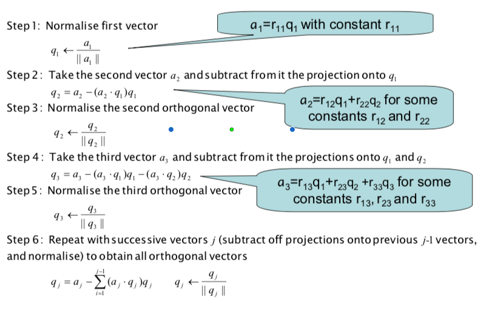
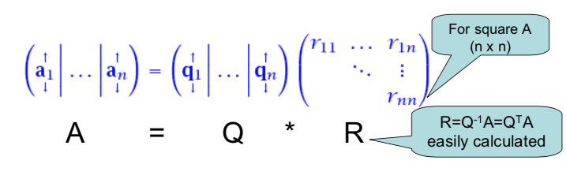

<style>
    slides > slide {
    overflow-x: auto !important;
    overflow-y: auto !important;
}
</style>


```{r setup, include=FALSE}
knitr::opts_chunk$set(tidy.opts = list(width.cutoff=60),
                      tidy = TRUE, 
                      echo = TRUE)
options(width = 60)
```

##  Finding eigenvalues and eigenvectors

- So far, we have only considered the characteristic polynomial approach to find the eigenvalues of a matrix
- Once we have the eigenvalues, we have been solving the homogeneous equation to find the corresponding eigenvectors
- The process is: find the eigenvalues first, and then find the corresponding eigenvectors


## Practicalities

- Unfortunately, this is an impractical approach for $n > 4$
- We will bypass the characteristic polynomial and now take a different approach
    - The Power Method
    - QR decomposition
    
# The Power Method

## The Power Method

- The Power Method finds the dominant eigenvalue $\lambda_1$ and corresponding dominant eigenvector $v_1$ of a matrix $A$
- The dominant eigenvalue is the one with the largest modulus (absolute value for real eigenvalues)
- The Power Method is an iterative approach that generates a sequence of scalars that converge to $\lambda_1$ and a sequence of vectors that converge to $v_1$
- The Power Method works well (converges quickly) when the dominant eigenvalue is clearly dominant

## The Power Method

- It works by starting with an initial vector $x_0$, transforming to $x_1 = Ax_0$, transforming $x_1$ to $x_2 = Ax_1$, etc.

$$x_1 = Ax_0;~x_2 = Ax_1 = A^2x_0; \cdots; x_k = A^kx_0.$$
- As $k\rightarrow \infty$, $x_k \rightarrow v_1$.

## Proof of convergence

- Assume $\lambda_1$ is the dominant eigenvalue.
- $|\lambda_1| > |\lambda_2| > \cdots > |\lambda_n|$.
- Assume there are $n$ independent eigenvectors $v_1, \cdots, v_n$.
- $x_0 = c_1 v_1 + \cdots + c_nv_n$.
- $x_k = ?$

## Estimation of eigenvalues

So once we have an eigenvector estimate we can quickly estimate the corresponding eigenvalue

$$Ax = \lambda x \Rightarrow x^T Ax = \lambda x^Tx \Rightarrow \lambda = \frac{x^TAx}{x^Tx} = \frac{x^TAX}{||x||^2} = q^TAq.$$

##  Practical Power method (normalised)


Since the components of $x_k$ just get larger and larger as the Power Method iterates, and we really just want to know the direction of $v_1$ (not its magnitude), we normalise each $x_k$.

So the Power Method can be summarised as:

- Set initial vector $q_0 = x_0/(||x_0||)$.

- Repeat for k

    - Compute $x_k = Aq_{k-1}$
    - Normalise $q_k = x_k/||x_k||$
    - Estimate $\lambda_k = q_k^TAq_k$
    
    
## Comments

- The Power method is not expected to converge if the matrix A is not diagonalisable
- Convergence rate depends on how dominant $\lambda_1$ is
- Google uses it to calculate the PageRank and Twitter uses it to show users recommendations of who to follow.
- And for non-dominant eigenvalues/vectors?

# Lab session

##

Now use The Power Method to redo your google pagerank problem

# QR decomposition

##  Eigenvalue Revealing Decomposition

- It would be nice if we could get our matrix $A$ into an **eigenvalue revealing decomposition** like  Schur decomposition $A = QSQ^T$
- So we can read off the eigenvalues (all of them) from the diagonal
- We will do it iteratively using QR decomposition: $A = QR$ 
- QR decomposition is not an eigenvalue revealing decomposition, but it will help us with our aim
- QR decomposition can be done with Gram-Schmidt Orthogonalisation (GSO) algorithm

## GSO algorithm

Any set of basis vectors $(ɑ_1, ɑ_2, \cdots, ɑ_n)$ can be transformed to an orthonormal basis $(q_1,q_2,\cdots,q_n)$ by:

<center>    

</center>


## GSO $\rightarrow$ QR

<center>

</center>

## QR

For any $m \times n$ matrix $A$, we can express $A$ as $A = QR$.

- $Q$ is $m\times m$, orthogonal
- $R$ is $m\times n$, upper triangular

For (non-square) tall matrices $A$  with $m > n$, the last
($m-n$) rows of $R$ are all zero, so we can express $A$ as:

$$ A = QR = (Q_1, Q_2) \left(\begin{array}{cc}R_1 \\ \mathbf{0} \end{array}\right) = Q_1R_1.$$

## QR algorithm

This algorithm computes an upper triangular matrix $S$ and a unitary matrix $Q$ such that $A = QSQ^T$ is the Schur decomposition of $A$.

1. Set $A_0 := A$.
2. for $k = 1, 2, \cdots$, 
    - $A_{k-1} = Q_kR_k.$
    - $A_k := R_kQ_k.$
3. Set $S := A_{\infty}.$

# Lab session

##

- Go to R code up QR algorithm.
- Use QR algorithm on $A = \left( \begin{array}{cc}  1 & 2 \\ 3 & 4 \end{array}\right)$.Any set of basis vectors (ɑ1, ɑ2, ..., ɑn) can be transformed to an orthonormal basis (q1,q2,...,qn) by:
   
##  Solution to $Ax=b$ by QR

If we have $A=QR$ or (even better) the economy form $A=Q_1R_1$, then the linear system $Ax = b$ can be easily solved:
$$Ax = b$$
$$(Q_1R_1)x=b$$
$$R_1x = Q_1^Tb$$
and $x$ is found through back substitution.


##  Computation of the SVD by QR

Just as we can use $A=QR$ to avoid calculating $A^TA$ in the normal equations, we can also use QR decomposition to solve the eigenvalue problems for $A^TA$ and $AA^T$ to obtain the SVD of $A$.


# Lab session

##

Use QR decomposition to write your own svd function in R.


