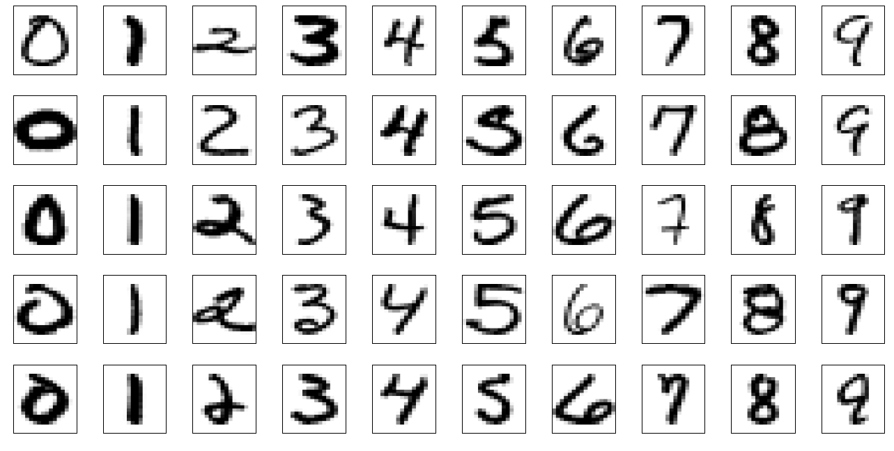
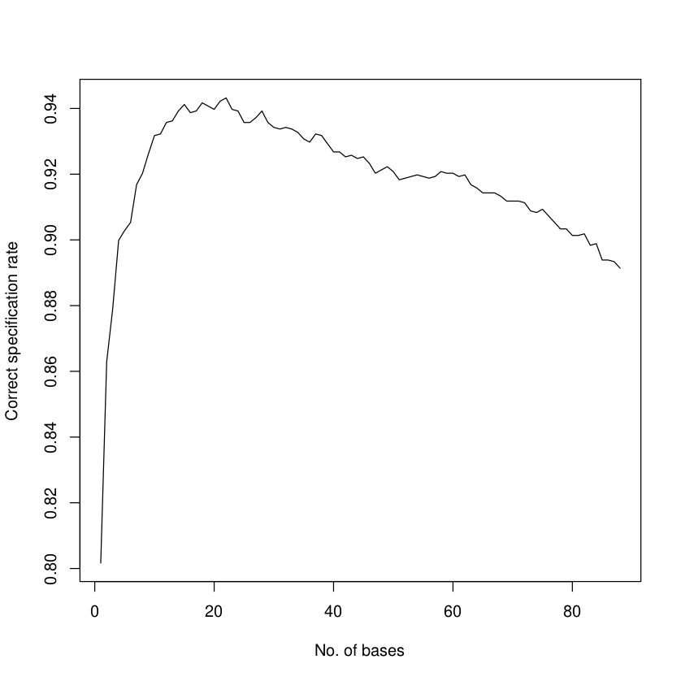

<style>
    slides > slide {
    overflow-x: auto !important;
    overflow-y: auto !important;
}
</style>


```{r setup, include=FALSE}
knitr::opts_chunk$set(tidy.opts = list(width.cutoff=60),
                      tidy = TRUE, 
                      echo = TRUE,
                      fig.align = 'center')
options(width = 60)
```


## Classification of handwritten digits

<center>    

</center>

## Read images in R

```{r, fig.width=6, fig.height=6}
## The image matrix for training sample. 256x1707
azip <- read.table("azip.dat")

## The true digits given in the training sample. length = 1707
dzip <- as.numeric(read.table("dzip.dat"))

## The testing image matrix. 256x2007
testzip <- read.table("testzip.dat")

## The true digits for the testing sample. length = 2007
dtest <- read.table("dtest.dat")

## Display the image
i <- 120
image(matrix(azip[ , i], ncol = 16)[, 16:1], col = gray(255:0/255))
```

##  The naive method

The naive method is to check the distance from each test image to the mean of training image.

```{r}
## The mean of training sample of a single digit
digits <- 0:9 # The possible digits in the US postal code
img.mean <- matrix(0, 256, length(digits))

for(i in digits)
  {
    idx <- (i == dzip) # the location indicator for the ith digit
    imgi <- azip[, idx, drop = FALSE]
    imgi.mean <- rowMeans(imgi)
    img.mean[,  i+1] <- imgi.mean
  }

## Plot the mean image
par(mfrow = c(2, 5))
for(i in 1:10)
  {
    image(matrix(img.mean[, i], ncol = 16)[, 16:1],
          col = gray(255:0/255))
}
```


## The naive method

- Now it is the time to check the testing sample to the mean of the training sample. We pick the first five testing digits.
- We find the first, third and the fifth are rather easy to classify by eyeballs. But the second and fourth ones are particular difficult.


```{r}
## Sketch a distance function to compute the Euclidean distance between two
## matrices in row wise.
rdist <- function(X, Y)
  {
    dim.X <- dim(X)
    dim.Y <- dim(Y)
    sum.X <- matrix(rowSums(X^2), dim.X[1], dim.Y[1])
    sum.Y <- matrix(rowSums(Y^2), dim.X[1], dim.Y[1], byrow = TRUE)
    dist0 <- sum.X + sum.Y - 2*tcrossprod(X, Y)
    out <- sqrt(dist0)
    return(out)
  }

## For an unknown testing digit image, compare the distance to the means
test.sample <- 1:5

## Let's first plot those testing image
par(mfcol = c(ceiling(length(test.sample)/5), 5)) # five columns

for(i in test.sample)
  {
    image(matrix(testzip[, i], ncol = 16)[, 16:1], col = gray(255:0/255))
  }

## Calculate the distance from testing sample to the mean in the training
## sample.
img.dist <- rdist(t(testzip[, test.sample]), t(img.mean))


## The classification results by the naive method
apply(img.dist, 1, which.min)-1
```

## The SVD method

- We pick the digit 9 as an example in this method and plot the first ten singular image from the SVD decomposition.
- We first use four bases, which yields the correct specification as follows. We also tries to classify other digits which gives robust results. But when we increase more basis function, there comes the risk of overfitting.
- It maybe not a good idea to use all the bases but one can always pick up the bases according to the first kth largest eigen values.

##  The SVD method


```{r}
## Compute the singular matrix of a single digit in the training sample
digit <- 9

## Subtract the matrix for that digit
img.mat <- azip[, digit == dzip, drop = FALSE]
img.matSVD <- svd(img.mat)

## Plot the singular matrix under different basis.
par(mfrow = c(2, 5))
for(i in 1:10)
  {
    image(matrix(img.matSVD$u[, i], 16)[, 16:1], col = gray(255:0/255), main =
          paste("singular image ", i, sep = ""))
  }

```

## Testing based on SVD

```{r, fig.width=6, fig.height=6, fig.align='center'}
## Do the least square method with different basis and find the minimal
## residuals.

## The testing digit matrix
test.idx <- 2
image(matrix(testzip[, test.idx], 16)[, 16:1], col = gray(255:0/255), main =
      paste("Testing digit"))

resid.norm <- matrix(NA, 10, 1, dimnames = list(0:9,"resid"))
for(i in 0:9)
  {
    img.mat <- azip[, i == dzip, drop = FALSE]
    img.matSVD <- svd(img.mat)
    # basis.max <- ncol(img.matSVD$u)
    basis.max <- 4
    resid.norm[i+1, ] <- norm(matrix(lm(testzip[, test.idx]~
                                        0+img.matSVD$u[, 1:basis.max])$resid), "F")
  }
resid.norm
```

## The SVD method

- We will find out when we overfit (see the plot of classification success as a function of the number of basis vectors.)
- To see this, we loop over all testing observations and number of bases from 1 to 88, and then count the correct specification numbers.

<center>    

</center>

