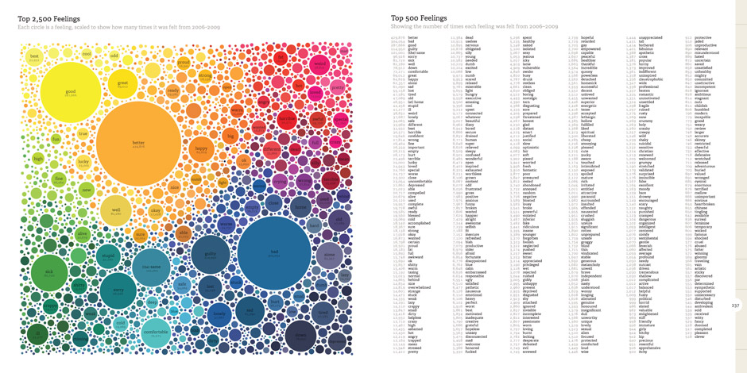
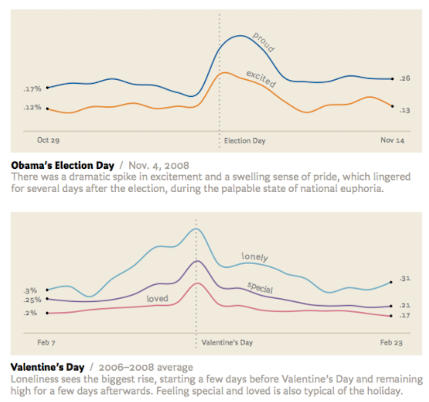
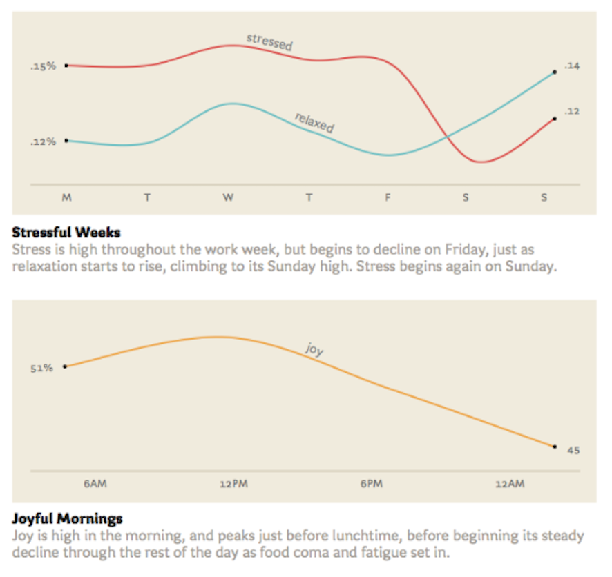
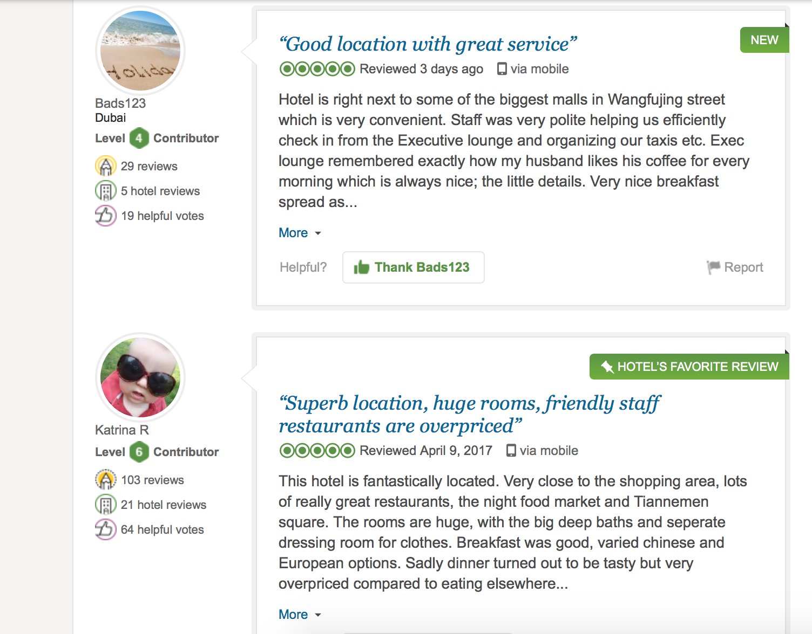

--- 
title       : Web Scraping with R
subtitle    : An introduction for beginners
author      : Feng Li
job         : feng.li@cufe.edu.cn
framework   : io2012   # {io2012, html5slides, shower, dzslides, ...}
highlighter : highlight.js  # {highlight.js, prettify, highlight}
hitheme     : solarized_light  # 
widgets     : mathjax
mode        : selfcontained # {standalone, draft, selfcontained}
transition  : fade


---
## Outline


- Why web scraping?
- What researchers do with web data?
- How to scrape web data?

--- bg:#f5f5ae 
<br>
<br>
<br>
<br>
<br>
<br>
<br>
<center>
## Why web scraping?

--- 
## Why do we need Web Scraping?

- Data on the web is growing exponentially.

- If the only way you access the Internet is through a browser, you’re missing out on a huge range of possibilities.

- Rather than viewing one page at a time, you can access thousands or even millions of pages at once.

- If you can view it in your browser $\Rightarrow$ you can access it via a script $\Rightarrow$ you can store it in a database
$\Rightarrow$ you can do virtually anything with that data.

--- 
## A practical application: ["We Feel Fine"](https://www.wefeelfine.org) 

- Project by Jonathan Harris and Sep Kamvar.
- Scraped a variety of English-language blog sites for phrases starting with "I feel" or "I am feeling".
- Describe how the world was feeling day by day and minute by minute.


--- 
## "We Feel Fine"
<center>



--- &twocol w1:50% w2:50%
<br>
<br>
<center>

*** =left


*** =right



--- bg:#f5f5ae 
<br>
<br>
<br>
<br>
<br>
<br>
<br>
<center>
## What researchers do with web data?

---

<center>


---


<center>

</center>


---

<center>


---
<br>
<br>
<br>
<center>


---

<center>


---

<center>


--- &twocol w1:50% w2:50%
## But web data is messy!

Most of the web data is not readily available. It is present in an unstructured format (HTML format).


*** =left


*** =right


---
## Data we really want

But we want a tidy format of data!
  + rows == observations 
  + columns == attributes

| Movie         | Score          |Length (mins)   |Language         |
| ------------- |:-------------: |:-------------: | :-------------: | 
| 爱乐之城      | 8.4            | 128            |English          |
| 看不见的客人  | 8.7            | 106            |Spanish          |
| ...           | ...            |...             |  ...            | 


<br>
<center>
### **Web scraping expertise required!**


--- bg:#f5f5ae 
<br>
<br>
<br>
<br>
<br>
<br>
<br>
<center>
## How to scrape web data?


---
## Get familiar with the structure of a html (tags)

- When we do web scraping, we deal with html tags to find the path of the information we want to extract.

- A simple html source code: tree structure of html tags. HTML tags normally come in pairs.
    
```
<!DOCTYPE html>
<html>
  <title> My title
  </title>
  <body>
    <h1> My first heading </h1>
      <p> My first paragraph </p>
  </body>
</html>
```


---
## Work with other useful tags

- HTML links are defined with the `<a>` tag
```
<a href="http://www.test.com">This is a link for test.com</a>
```
- HTML tables are defined with `<table>`, row as `<tr>` and rows are divided into data as `<td>`

- HTML list starts with `<ul>` (unordered) and `<ol>` (ordered). Each item of list starts with `<li>`

- Try http://www.tryiteditor.com to learn more about html. 

---
## XPath

- When we do web scraping, we use XPath to locate the piece of data we want.

- Path used to select nodes and info in html.

- One of the most crucial step to do web scraping.


```
<!DOCTYPE html>
<html>
  <title> My title
  </title>
  <body>
    <h1> My first heading </h1>
      <p> My first paragraph </p>
  </body>
</html>
```
- `/html/title`: selects the `<title>` element of an HTML document 
- `//p`: selects all the `<p>` elements

--- 
## XPath
```
<html> 
  <head>
    <title>Example website</title> 
  </head>
  <body>
    <div id='images', class='img'>
      <a href='image1.html'>Name: Image 1</a> 
      <a href='image2.html'>Name: Image 2</a> 
    </div> 
  </body>
</html>
```


- `//div[@id="images"]`: selects all the `<div>` elements which contain an attribute `id="images"`. 
    
- `//div[@id="images"]/a/`: selects all the `<a>` elements inside the aforementioned element.


---
## XPath

```
<td class="zwmc" style="width: 250px;">
  <div style="width: 224px;*width: 218px; _width:200px; float: left">
    <a style="font-weight: bold">金融分析师</a>
  </div>
</td>
```


- `//td[@class="zwmc"]/div/a`
- `//td[@class="zwmc"]//a`


---
## Where to go?

scrape job information from http://sou.zhaopin.com of jobs related to '阿里巴巴'.

- Inspect a web page (easily found in Chrome).

- Find the xpath for the elements you want to extract
    - E.g., xpath for job titles: `//td[@class="zwmc"]/div/a`.
    - You can also find xpath from viewing the whole page source


---
##  Scrapping a webpage using rvest package in R


- Parse the entire website: `read_html()`.
- Find and extract the pieces of the website you need using XPath: `html_nodes()`. It pull out the entire node.
- The following are done after using html_nodes() to extract content we need.
    - `html_table()`:  extract all data inside a html table.
    - `html_text()`:  extract all text within the node.
    - `html_attr()`: extract contents of a single attribute.
    - `html_attrs()`: extract all attributes. 
- Cleanup

---
## Go back to previous examples


```r
web <- read_html('<!DOCTYPE html>
<html>
  <title> My title
  </title>
  <body>
    <h1> My first heading </h1>
      <p> My first paragraph </p>
  </body>
</html>')
title_node <- html_nodes(web, xpath = '//title')
# html_text(title_node)
str_trim(html_text(title_node))
```

```
## [1] "My title"
```

---
## Now we want to scrape data from a html table


```r
url <- "https://en.wikipedia.org/wiki/Provinces_of_China"
web <- read_html(url)
provinces_nodes <-
  html_nodes(web, xpath = '//*[@class="wikitable sortable"]')
provinces <- html_table(provinces_nodes)
```

---
<br>
<br>
<table>
 <thead>
  <tr>
   <th style="text-align:left;">  </th>
   <th style="text-align:left;">  </th>
   <th style="text-align:left;">  </th>
   <th style="text-align:left;">  </th>
   <th style="text-align:left;">  </th>
   <th style="text-align:left;">  </th>
   <th style="text-align:left;">  </th>
   <th style="text-align:left;">  </th>
   <th style="text-align:left;">  </th>
  </tr>
 </thead>
<tbody>
  <tr>
   <td style="text-align:left;"> GB[2] </td>
   <td style="text-align:left;"> ISO[3] </td>
   <td style="text-align:left;"> Province </td>
   <td style="text-align:left;"> Chinese
Hanyu Pinyin </td>
   <td style="text-align:left;"> Capital </td>
   <td style="text-align:left;"> Population1 </td>
   <td style="text-align:left;"> Density2 </td>
   <td style="text-align:left;"> Area3 </td>
   <td style="text-align:left;"> Abbreviation4 </td>
  </tr>
  <tr>
   <td style="text-align:left;"> BJ </td>
   <td style="text-align:left;"> CN-11 </td>
   <td style="text-align:left;"> Beijing Municipality </td>
   <td style="text-align:left;"> 北京市Běijīng Shì </td>
   <td style="text-align:left;"> Beijing </td>
   <td style="text-align:left;"> 19,612,368 </td>
   <td style="text-align:left;"> 1,167.40 </td>
   <td style="text-align:left;"> 16,800 </td>
   <td style="text-align:left;"> 京Jīng </td>
  </tr>
  <tr>
   <td style="text-align:left;"> TJ </td>
   <td style="text-align:left;"> CN-12 </td>
   <td style="text-align:left;"> Tianjin Municipality </td>
   <td style="text-align:left;"> 天津市Tiānjīn Shì </td>
   <td style="text-align:left;"> Tianjin </td>
   <td style="text-align:left;"> 12,938,224 </td>
   <td style="text-align:left;"> 1,144.46 </td>
   <td style="text-align:left;"> 11,305 </td>
   <td style="text-align:left;"> 津Jīn </td>
  </tr>
  <tr>
   <td style="text-align:left;"> HE </td>
   <td style="text-align:left;"> CN-13 </td>
   <td style="text-align:left;"> Hebei Province </td>
   <td style="text-align:left;"> 河北省Héběi Shěng </td>
   <td style="text-align:left;"> Shijiazhuang </td>
   <td style="text-align:left;"> 71,854,202 </td>
   <td style="text-align:left;"> 382.81 </td>
   <td style="text-align:left;"> 187,700 </td>
   <td style="text-align:left;"> 冀Jì </td>
  </tr>
  <tr>
   <td style="text-align:left;"> SX </td>
   <td style="text-align:left;"> CN-14 </td>
   <td style="text-align:left;"> Shanxi Province </td>
   <td style="text-align:left;"> 山西省Shānxī Shěng </td>
   <td style="text-align:left;"> Taiyuan </td>
   <td style="text-align:left;"> 35,712,111 </td>
   <td style="text-align:left;"> 228.48 </td>
   <td style="text-align:left;"> 156,300 </td>
   <td style="text-align:left;"> 晋Jìn </td>
  </tr>
  <tr>
   <td style="text-align:left;"> NM </td>
   <td style="text-align:left;"> CN-15 </td>
   <td style="text-align:left;"> Inner Mongolia Autonomous Region </td>
   <td style="text-align:left;"> 內蒙古自治区Nèi Měnggǔ Zìzhìqū </td>
   <td style="text-align:left;"> Hohhot </td>
   <td style="text-align:left;"> 24,706,321 </td>
   <td style="text-align:left;"> 20.88 </td>
   <td style="text-align:left;"> 1,183,000 </td>
   <td style="text-align:left;"> 內蒙古(蒙)Nèi Měnggǔ (Měng) </td>
  </tr>
</tbody>
</table>


---
##  Now scrape some employment data


```r
library(rvest)
url <- 'http://sou.zhaopin.com/jobs/searchresult.ashx?jl=北京&kw=阿里巴巴'
web <- read_html(url)
job_title_nodes <- html_nodes(web, xpath = '//td[@class="zwmc"]/div/a')
job_title <- html_text(job_title_nodes)
job_title[1:2]
```

```
## [1] "阿里妈妈-java研发专家-北京"   "大文娱-APP推广-PP助手&豌豆荚"
```

```r
link <- html_attr(job_title_nodes, 'href')
link[1:2]
```

```
## [1] "http://jobs.zhaopin.com/000127917285693.htm"     
## [2] "http://jobs.zhaopin.com/00012791790284592000.htm"
```

---
## Pipeable!

```
job_title_nodes <- html_nodes(web, xpath = '//td[@class="zwmc"]/div/a')
job_title <- html_text(job_title_nodes)
```

$\Downarrow$

```
job_title <- web %>%
  html_nodes(xpath = '//td[@class="zwmc"]/div/a') %>%
  html_text()
```

---
## Let's extract more data


```r
url <- 'http://sou.zhaopin.com/jobs/searchresult.ashx?jl=北京&kw=阿里巴巴'
web <- read_html(url, encoding = "utf-8")
job_title <- web %>%
  html_nodes(xpath = '//td[@class="zwmc"]/div/a') %>% html_text()
link <- web %>%
  html_nodes(xpath = '//td[@class="zwmc"]/div/a') %>% html_attr('href')
company <- web %>%
  html_nodes(xpath = '//td[@class="gsmc"]') %>% html_text()
salary <- web %>%
  html_nodes(xpath = '//td[@class="zwyx"]') %>% html_text()
location <- web %>%
  html_nodes(xpath = '//td[@class="gzdd"]') %>% html_text()
alibaba_jobs <- data.frame(job_title, company, salary, location, link)
```

---
<br>
<br>

<table>
 <thead>
  <tr>
   <th style="text-align:left;"> job_title </th>
   <th style="text-align:left;"> company </th>
   <th style="text-align:left;"> salary </th>
   <th style="text-align:left;"> location </th>
   <th style="text-align:left;"> link </th>
  </tr>
 </thead>
<tbody>
  <tr>
   <td style="text-align:left;"> 阿里妈妈-java研发专家-北京 </td>
   <td style="text-align:left;"> 阿里巴巴集团 </td>
   <td style="text-align:left;"> 面议 </td>
   <td style="text-align:left;"> 北京 </td>
   <td style="text-align:left;"> http://jobs.zhaopin.com/000127917285693.htm </td>
  </tr>
  <tr>
   <td style="text-align:left;"> 大文娱-APP推广-PP助手&amp;豌豆荚 </td>
   <td style="text-align:left;"> 阿里巴巴集团 </td>
   <td style="text-align:left;"> 面议 </td>
   <td style="text-align:left;"> 北京 </td>
   <td style="text-align:left;"> http://jobs.zhaopin.com/00012791790284592000.htm </td>
  </tr>
  <tr>
   <td style="text-align:left;"> 大文娱-SEM优化师-UC </td>
   <td style="text-align:left;"> 阿里巴巴集团 </td>
   <td style="text-align:left;"> 面议 </td>
   <td style="text-align:left;"> 北京 </td>
   <td style="text-align:left;"> http://jobs.zhaopin.com/00012791790284591000.htm </td>
  </tr>
  <tr>
   <td style="text-align:left;"> 大文娱-广告平台优化师-UC </td>
   <td style="text-align:left;"> 阿里巴巴集团 </td>
   <td style="text-align:left;"> 面议 </td>
   <td style="text-align:left;"> 北京 </td>
   <td style="text-align:left;"> http://jobs.zhaopin.com/00012791790284967000.htm </td>
  </tr>
  <tr>
   <td style="text-align:left;"> 大文娱-app推广-UC </td>
   <td style="text-align:left;"> 阿里巴巴集团 </td>
   <td style="text-align:left;"> 面议 </td>
   <td style="text-align:left;"> 北京 </td>
   <td style="text-align:left;"> http://jobs.zhaopin.com/00012791790284968000.htm </td>
  </tr>
  <tr>
   <td style="text-align:left;"> 大文娱-运营优化师-终端 </td>
   <td style="text-align:left;"> 阿里巴巴集团 </td>
   <td style="text-align:left;"> 面议 </td>
   <td style="text-align:left;"> 北京 </td>
   <td style="text-align:left;"> http://jobs.zhaopin.com/00012791790285570000.htm </td>
  </tr>
</tbody>
</table>

---
## How to turn pages?

Think about how to turn pages.

---
## Extract more job details via its link


```r
get_job_detail <- function(link){
  link = as.character(link)
  web = read_html(link)
  experience = web %>%
    html_nodes(xpath ='//ul[@class="terminal-ul clearfix"]/li[5]/strong') %>% html_text()
  degree = web %>%
    html_nodes(xpath ='//ul[@class="terminal-ul clearfix"]/li[6]/strong') %>% html_text()
  number = web %>%
    html_nodes(xpath ='//ul[@class="terminal-ul clearfix"]/li[7]/strong') %>% html_text()
  description = web %>%
    html_nodes(xpath ='//div[@class="terminalpage-main clearfix"]/div/div[1]')%>% html_text()
  description = str_trim(sub('查看职位地图', '', description))
  link_details = data.frame(experience, degree, number, description)
  return(link_details)
}
```

---
## Extract more job details via its link

```r
job_details <- data.frame()
for (i in 1:nrow(alibaba_jobs)){
  job_details = rbind(job_details, get_job_detail(alibaba_jobs$link[i]))
}
alibaba_job_details <- cbind(alibaba_jobs, job_details)
kable(head(subset(alibaba_job_details, select = -c(link,description))), format = "html")
```

<table>
 <thead>
  <tr>
   <th style="text-align:left;"> job_title </th>
   <th style="text-align:left;"> company </th>
   <th style="text-align:left;"> salary </th>
   <th style="text-align:left;"> location </th>
   <th style="text-align:left;"> experience </th>
   <th style="text-align:left;"> degree </th>
   <th style="text-align:left;"> number </th>
  </tr>
 </thead>
<tbody>
  <tr>
   <td style="text-align:left;"> 阿里妈妈-java研发专家-北京 </td>
   <td style="text-align:left;"> 阿里巴巴集团 </td>
   <td style="text-align:left;"> 面议 </td>
   <td style="text-align:left;"> 北京 </td>
   <td style="text-align:left;"> 3-5年 </td>
   <td style="text-align:left;"> 本科 </td>
   <td style="text-align:left;"> 若干 </td>
  </tr>
  <tr>
   <td style="text-align:left;"> 大文娱-APP推广-PP助手&amp;豌豆荚 </td>
   <td style="text-align:left;"> 阿里巴巴集团 </td>
   <td style="text-align:left;"> 面议 </td>
   <td style="text-align:left;"> 北京 </td>
   <td style="text-align:left;"> 3-5年 </td>
   <td style="text-align:left;"> 本科 </td>
   <td style="text-align:left;"> 若干 </td>
  </tr>
  <tr>
   <td style="text-align:left;"> 大文娱-SEM优化师-UC </td>
   <td style="text-align:left;"> 阿里巴巴集团 </td>
   <td style="text-align:left;"> 面议 </td>
   <td style="text-align:left;"> 北京 </td>
   <td style="text-align:left;"> 3-5年 </td>
   <td style="text-align:left;"> 本科 </td>
   <td style="text-align:left;"> 若干 </td>
  </tr>
  <tr>
   <td style="text-align:left;"> 大文娱-广告平台优化师-UC </td>
   <td style="text-align:left;"> 阿里巴巴集团 </td>
   <td style="text-align:left;"> 面议 </td>
   <td style="text-align:left;"> 北京 </td>
   <td style="text-align:left;"> 3-5年 </td>
   <td style="text-align:left;"> 本科 </td>
   <td style="text-align:left;"> 若干 </td>
  </tr>
  <tr>
   <td style="text-align:left;"> 大文娱-app推广-UC </td>
   <td style="text-align:left;"> 阿里巴巴集团 </td>
   <td style="text-align:left;"> 面议 </td>
   <td style="text-align:left;"> 北京 </td>
   <td style="text-align:left;"> 3-5年 </td>
   <td style="text-align:left;"> 本科 </td>
   <td style="text-align:left;"> 若干 </td>
  </tr>
  <tr>
   <td style="text-align:left;"> 大文娱-运营优化师-终端 </td>
   <td style="text-align:left;"> 阿里巴巴集团 </td>
   <td style="text-align:left;"> 面议 </td>
   <td style="text-align:left;"> 北京 </td>
   <td style="text-align:left;"> 5-10年 </td>
   <td style="text-align:left;"> 本科 </td>
   <td style="text-align:left;"> 若干 </td>
  </tr>
</tbody>
</table>


---
##  Practice if you like

- Extract at least 5 attributes of the movies listed on Douban top 250 (https://movie.douban.com/top250)

- Extract the top 5 pages of hotel information including the newest reviews from TripAdvisor (https://www.tripadvisor.com/Hotels-g294212-Beijing-Hotels.html)

- Extract the top 5 pages of book information from Amazon (https://www.amazon.cn/s/ref=nb_sb_noss?__mk_zh_CN=亚马逊网站&field-keywords=大数据)


---
## Some notes

- When you scrape a website too frequently, the server may reject your request. One possible solution is to stop for several seconds irregularly.

- Not every website is scrappable! Some websites go with really high technoloy to protect their data from being extracted. For example, they use javascript, or really complex captcha codes.

- Python has more functionality for web scraping. It is more flexible to deal with the problems mentioned above. If you are interested in that, please refer to [this book](https://yanfei.site/docs/dpsa/references/PyWebScrapingBook.pdf). Basics of web scraping with Python are similar.

---
## References 


- [`rvest`](https://cran.r-project.org/web/packages/rvest/rvest.pdf)
- [Wikibooks on text processing](https://en.wikibooks.org/wiki/R_Programming/Text_Processing)


## Further readings

- Other packages like `XML`, `RCurl` and `scrapR` are also used for web scraping
- [Web Scraping with Python](https://yanfei.site/docs/dpsa/references/PyWebScrapingBook.pdf)

---
<center>
## Questions?
</br>
<div align='center'>

</div>
